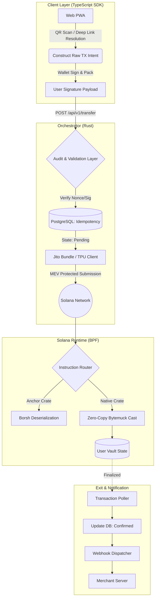
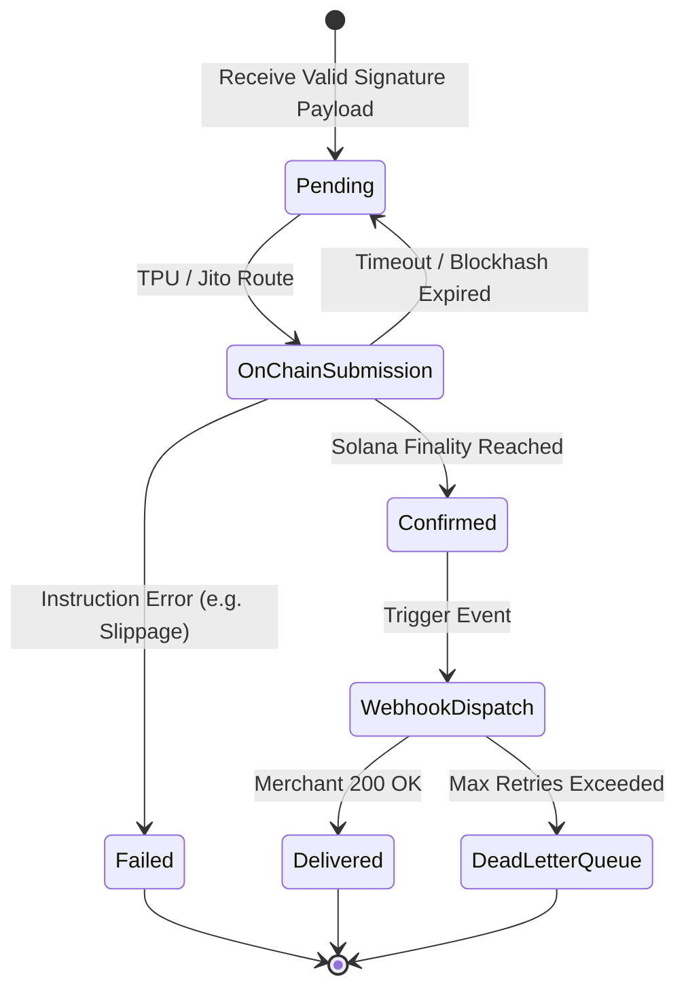
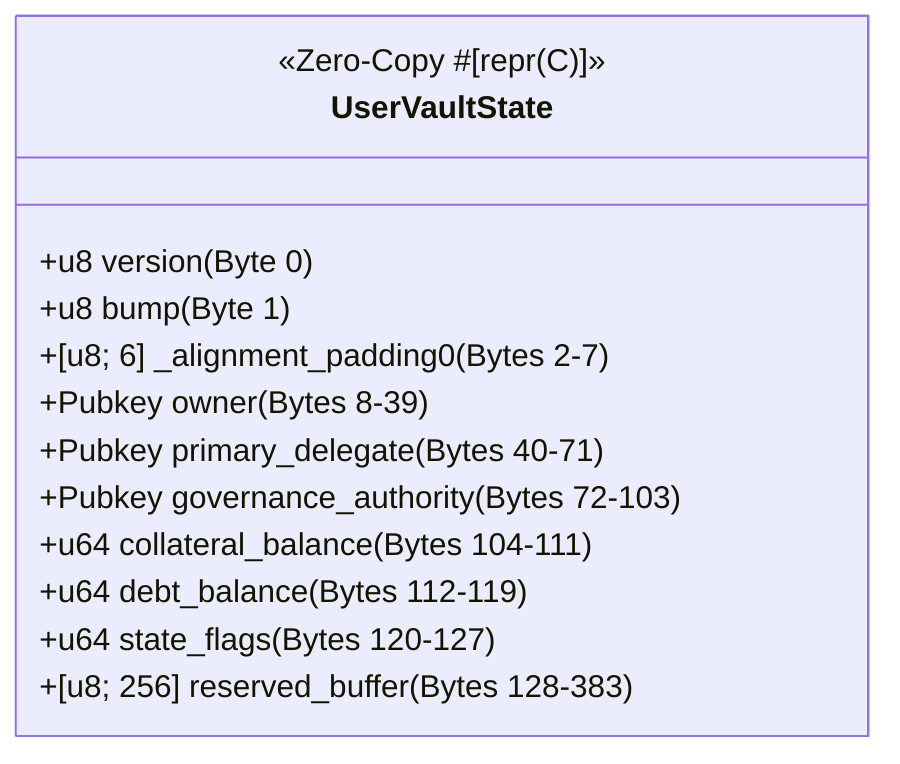

# 🏦 Stablecoin Payment System

> A high-performance, dual-implementation (Anchor reference + native zero-copy) Solana stablecoin payment rail with an enterprise-grade orchestrator, idempotent APIs, webhook reliability, and future-proof on-chain state.

## 📑 Table of Contents

1. [System Architecture](https://www.google.com/search?q=%23-system-architecture)
2. [Directory Structure](https://www.google.com/search?q=%23-directory-structure)
3. [Master Invariant List](https://www.google.com/search?q=%23-master-invariant-list)
4. [Subsystem Threat Matrix & Mitigations](https://www.google.com/search?q=%23-subsystem-threat-matrix--mitigations)

---

## 🏛️ System Architecture

### 1. Macro Execution Flow (Web-First Cryptographic Intent to Settlement)

The logical data flow enforces strict separation of concerns. The Web PWA handles the QR/Payment Link resolution and non-custodial cryptographic signing. The Orchestrator acts solely as an audit and compilation layer, validating the payload nonce and bypassing mempool latency via direct TPU/Jito submission.



### 2. Idempotency & Delivery State Machine

Network partitions will happen. The system guarantees exact-once execution using immutable database constraints mapped to Solana transaction signatures, completely mitigating client-side retry floods.



### 3. Native Zero-Copy Memory Layout (#[repr(C)])

To survive the BPF VM alignment rules without reallocation, the `StablecoinState` account must be an immutable byte window.



---

## 📂 Directory Structure

```text
stablecoin-payment-system/
├── README.md
├── docker-compose.yml
├── Makefile
├── .env.example
├── .github/
│   └── workflows/
│       ├── ci.yml
│       └── deploy.yml
│
└── onchain/
|    ├── Anchor.toml                    # Workspace test orchestrator and cluster configurations
|    ├── Cargo.toml                     # Virtual workspace root defining members and profile.release limits
|    ├── package.json                   # TS client dependencies for integration tests
|    ├── tsconfig.json
|    │
|    ├── programs/
|    │   ├── shared_memory/             # 🧠 THE SINGLE SOURCE OF TRUTH (No Executable Logic)
|    │   │   ├── Cargo.toml             # Defines `anchor-bridge` and `native-bridge` features
|    │   │   └── src/
|    │   │       ├── lib.rs
|    │   │       ├── state.rs           # Conditionally compiled #[repr(C)] structs
|    │   │       ├── instructions.rs    # Raw byte payloads for the orchestrator
|    │   │       └── error.rs           # Shared custom error codes
|    │   │
|    │   ├── anchor_stablecoin/         # 🏢 CONTROL PLANE (Admin, Governance, IDL)
|    │   │   ├── Cargo.toml             # Imports shared_memory with 'anchor-bridge'
|    │   │   ├── Xargo.toml             # BPF compilation targets
|    │   │   └── src/
|    │   │       ├── lib.rs             # IDL Generation and routing
|    │   │       ├── instructions/
|    │   │       │   ├── initialize.rs  # Vault creation (Anchor Contexts)
|    │   │       │   └── admin.rs       # Threshold & fee configurations
|    │   │       └── events.rs
|    │   │
|    │   └── native_stablecoin/         # 🚀 DATA PLANE (Zero-Copy JIT Execution)
|    │       ├── Cargo.toml             # Imports shared_memory with 'native-bridge'
|    │       └── src/
|    │           ├── entrypoint.rs      # Naked process_instruction mapping
|    │           ├── processor.rs       # Raw C-ABI routing
|    │           ├── state_parser.rs    # Bytemuck slice projection engine
|    │           └── instructions/
|    │               ├── mint_jit.rs    # Sub-millisecond fiat bridging
|    │               ├── liquidate.rs
|    │               └── settle.rs
|    │
|    └── tests/                         # 🛡️ THE VALIDATION MATRIX
|        ├── integration/               # E2E PWA & Orchestrator Simulation
|        │   ├── setup.ts               # LocalValidator spins up both programs
|        │   ├── 01_admin_flow.test.ts  # Tests Anchor Control Plane
|        │   └── 02_jit_execution.test.ts # Tests Orchestrator -> Native Data Plane
|        │
|        ├── bpf/                       # Low-level Rust BankClient testing
|        │   ├── Cargo.toml
|        │   └── src/
|        │       ├── zero_copy_alignment.rs # Panics if memory padding is detected
|        │       └── compute_budget.rs      # Hard-fails if Native instruction > 20,000 CU
|        │
|        └── fuzz/                      # Trident Property-Based Testing
|            ├── Cargo.toml
|            ├── Trident.toml           
|            └── src/
|                ├── invariants.rs      # Asserts collateral == debt across 100k random txs
|                └── instructions.rs
│
├── orchestrator/                      # High-Velocity Corporate Routing Server (Rust)
│   ├── Cargo.toml
│   ├── Cargo.lock
│   ├── build.rs
│   ├── rustfmt.toml
│   ├── src/
│   │   ├── main.rs
│   │   ├── lib.rs
│   │   ├── config/
│   │   │   ├── mod.rs
│   │   │   ├── settings.rs
│   │   │   └── solana_config.rs
│   │   ├── domain/
│   │   │   ├── mod.rs
│   │   │   ├── payment.rs
│   │   │   ├── idempotency_key.rs
│   │   │   ├── webhook_event.rs
│   │   │   └── error.rs
│   │   ├── application/
│   │   │   ├── mod.rs
│   │   │   ├── mint_service.rs
│   │   │   ├── transfer_service.rs
│   │   │   ├── burn_service.rs
│   │   │   └── webhook_dispatcher.rs
│   │   ├── infrastructure/
│   │   │   ├── mod.rs
│   │   │   ├── kms/                   # 🔑 AWS / GCP Cloud KMS secure signer layer
│   │   │   │   ├── mod.rs
│   │   │   │   └── aws_client.rs
│   │   │   ├── queue/                 # 📦 Kafka event pipeline / Dead Letter Queues
│   │   │   │   ├── mod.rs
│   │   │   │   └── kafka_producer.rs
│   │   │   ├── solana/
│   │   │   │   ├── mod.rs
│   │   │   │   ├── client.rs          # Connection + dynamic priority fee calculations
│   │   │   │   ├── jito_bundle.rs     # 🌪️ Congestion-resilient MEV bundle submission
│   │   │   │   ├── tpu_client.rs      # 🚀 Direct-to-validator transaction ingestion
│   │   │   │   ├── transaction_builder.rs # Compiles raw packed buffers for the Native target
│   │   │   │   └── rpc_ext.rs
│   │   │   ├── db/
│   │   │   │   ├── mod.rs
│   │   │   │   ├── postgres.rs
│   │   │   │   ├── repositories/
│   │   │   │   │   ├── payment_repo.rs
│   │   │   │   │   ├── idempotency_repo.rs
│   │   │   │   │   └── webhook_repo.rs
│   │   │   │   └── migrations/
│   │   │   │       ├── 20260101000000_init.sql
│   │   │   │       └── 20260102000000_add_webhook_delivery.sql
│   │   │   ├── cache/
│   │   │   │   ├── mod.rs
│   │   │   │   └── redis.rs
│   │   │   ├── webhook/
│   │   │   │   ├── mod.rs
│   │   │   │   ├── sender.rs
│   │   │   │   └── signature.rs
│   │   │   └── metrics/
│   │   │       ├── mod.rs
│   │   │       └── prometheus.rs
│   │   ├── api/
│   │   │   ├── mod.rs
│   │   │   ├── http/
│   │   │   │   ├── mod.rs
│   │   │   │   ├── server.rs
│   │   │   │   ├── middleware/
│   │   │   │   │   ├── auth.rs
│   │   │   │   │   ├── rate_limiter.rs
│   │   │   │   │   ├── request_id.rs
│   │   │   │   │   └── logging.rs
│   │   │   │   ├── dto/
│   │   │   │   │   ├── request.rs
│   │   │   │   │   └── response.rs
│   │   │   │   └── handlers/
│   │   │   │       ├── mint.rs
│   │   │   │       ├── transfer.rs
│   │   │   │       ├── burn.rs
│   │   │   │       ├── webhook.rs
│   │   │   │       └── health.rs
│   │   │   └── websocket/
│   │   │       └── mod.rs
│   │   └── jobs/
│   │       ├── mod.rs
│   │       ├── webhook_retry_worker.rs
│   │       └── transaction_confirmation_poller.rs
│   └── tests/
│       ├── integration/
│       │   ├── mint_api_test.rs
│       │   ├── idempotency_test.rs
│       │   └── webhook_test.rs
│       └── e2e/
│           └── localnet.rs
│
├── sdk-client/                        # Zero-Dependency Client Abstraction Layer (TS)
│   ├── package.json
│   ├── tsconfig.json
│   ├── src/
│   │   ├── index.ts
│   │   ├── client.ts                  # Merchant initialization and payload resolution logic
│   │   ├── tx_builder.ts              # Sequential packing with ZERO alignment gaps
│   │   └── types.ts
│   └── tests/
│
├── deployment/                        # Infrastructure-As-Code Production Hardening
│   ├── kubernetes/
│   │   ├── deployment.yaml
│   │   ├── service.yaml
│   │   ├── secrets-operator.yaml      # 🛡️ SOPS / External Secrets container configuration
│   │   ├── configmap.yaml
│   │   └── ingress.yaml
│   ├── terraform/
│   │   ├── main.tf
│   │   └── variables.tf
│   └── ansible/
│       └── playbook.yml
│
└── docs/
    ├── architecture.md                # Structural technical blueprints
    ├── api_spec.yaml                  # OpenAPI 3.0 contract verification
    └── runbook.md                     # Crisis mitigation protocols


```

---

## 🔒 Master Invariant List

Every component engineered in this repository must strictly adhere to these 20 edge-case mitigations:

1. **Account Size Growth:** Use a 256-byte `reserved` buffer. Parse newer fields only if `version >= 1`.
2. **Serialization Mismatch:** Keep Anchor Borsh and Native Zero-Copy memory layouts 100% identical.
3. **Overflow/Underflow:** Always use `checked_add`/`checked_sub`.
4. **Authority Revocation:** Use `Pubkey::default()` as a sentinel value. Add `is_frozen: bool`.
5. **PDA Re-derivation:** Store the `bump` in state to bypass runtime recalculation overhead.
6. **Reinitialization Attacks:** Check `version == 0` or use rent-exempt + discriminator.
7. **Feature Flag Conflicts:** Enforce mutual exclusivity in `initialize` via strict bitwise checks.
8. **Clock Dependencies:** Store the last timestamp in state; use conservative time windows.
9. **CPI Edge Cases:** Store target Pubkeys; add depth/reentrancy guards for transfer hooks.
10. **Data Migration:** Provide a `migrate` instruction strictly for the mint authority.
11. **Account Data Truncation:** Enforce exact `size_of::<StablecoinState>()` on initialization.
12. **Multi-Signature Governance:** Reserve space for `governance_pubkey` to deprecate single authorities.
13. **Regulatory Hooks:** Use bitflags + optional extension accounts (PDAs) for KYC/AML.
14. **Decimal Precision:** Enforce `decimals <= 9` (Solana convention).
15. **Zero Supply Edge:** Strict checks; explicitly allow `supply == 0` as a valid paused state.
16. **Rent Exemption:** Block account closure if `supply != 0`.
17. **Invariant Violations:** Trident fuzz suite must mathematically assert supply conservation.
18. **Network Congestion:** Orchestrator exclusively handles idempotency keys and dynamically injects priority fees to the client payload.
19. **Key Compromise:** Support authority updates + optional timelock.
20. **Benchmarking:** Fail CI if Zero-Copy casts fail on misaligned data or CU spikes.

---

## 🛡️ Subsystem Threat Matrix & Mitigations

### 1. On‑Chain Programs (Anchor & Native)

#### 1.1 Account State Layouts

| Edge case | Risk | Mitigation |
| --- | --- | --- |
| **Data size increase** | Zero‑copy parsers (`bytemuck`) may read garbage or panic. | Embed a `version: u8` as the first byte. Use `try_from_bytes` with length validation. |
| **Account reallocation** | Reallocation fails if lamports are insufficient. | Add a dedicated `resize_account` instruction. |
| **Maximum account size** | Single account cannot hold millions of records. | Use multiple PDAs for sharded data. Design state as an index. |
| **Discriminator collision** | Program misinterprets data. | Namespace discriminators: `sha256("namespace:AccountType")[..8]`. |
| **Zero‑copy alignment** | Padding bytes cause UB in `bytemuck::Pod`. | Use `bytemuck::Zeroable` and `Pod` with explicit padding (`_pad: [u8; N]`). |
| **Enums / instruction variants** | Old clients send unknown variants; program panics. | Include an `UnknownInstruction` fallback returning custom error. |
| **Account ordering** | Corrupted state / privilege escalation. | Validate each account’s pubkey against PDA seeds. Enforce strict checks. |

#### 1.2 Program Upgrade & Immutability

| Edge case | Risk | Mitigation |
| --- | --- | --- |
| **Upgrade authority set to None** | Bugs cannot be fixed; funds lost. | Keep authority behind multisig + timelock. |
| **Malicious upgrade** | Attacker replaces program. | Use Squads‑style multisig (3‑of‑5 minimum) + 24h timelock program. |
| **State migration** | Incompatible old data layout. | Support reading old versions lazily or provide one‑time migration instruction. |
| **Program closure** | Executable data remains on-chain. | Add “self‑destruct” instruction to drain lamports to treasury. |
| **Sysvar / Feature gates** | Runtime upgrades alter behavior. | Use official sysvar crate (`solana-program`’s `sysvar::clock`). |

#### 1.3 Token‑Specific & Authority

| Edge case | Risk | Mitigation |
| --- | --- | --- |
| **Mint authority rotation** | Cannot transfer power. | Include `set_mint_authority` instruction. |
| **Freeze / clawback** | Cannot block illicit funds. | Add `freeze_account` and `clawback` instructions. |
| **Pausability** | Cannot halt exploits. | Implement global `paused` flag in PDA. |
| **Close account** | Dust accounts waste rent. | Allow closure only after timeout with zero liabilities. |
| **Transfer hook compliance** | Incompatible with Token‑2022. | Explicitly call `spl‑transfer‑hook‑interface` in native handlers. |

#### 1.4 Compute & Transaction Limits

| Edge case | Risk | Mitigation |
| --- | --- | --- |
| **Compute budget creep** | TXs hit 1.4M CU limit. | Cap iteration counts; design for constant‑time execution. |
| **Transaction size limit** | >1232 bytes rejected. | Minimise accounts per call; use composable instructions. |
| **Account write lock** | Bottlenecks parallel TXs. | Shard state (per‑user accounts). |
| **Epoch boundary** | Blockhash expires. | Use durable nonces; set reasonable `max_age`. |

### 2. Orchestrator (Rust Backend)

#### 2.1 Domain Models & Database Schema

| Edge case | Risk | Mitigation |
| --- | --- | --- |
| **Idempotency TTL replay** | Duplicate client request re‑executes. | Store signature intent keys permanently in PostgreSQL (unique constraint). |
| **Idempotency collision** | Merchant requests hijack. | Prefix keys: `merchant_id:`. |
| **DB migrations** | Table changes crash application. | Expand‑contract migrations (add -> dual-write -> drop). |
| **API Schema versioning** | SDK breaks on new mandatory fields. | Version API (`/v1/...`) or use defaults forever. |
| **State machine failure** | Double-mint on DB update crash. | Idempotent TX IDs; insert signature payload with `ON CONFLICT DO NOTHING`. |

#### 2.2 Solana Transaction Handling

| Edge case | Risk | Mitigation |
| --- | --- | --- |
| **Shallow-fork rollback** | Webhook sent for reverted payment. | Wait for `finalized` commitment (32+ slots). |
| **Priority fee wars** | TXs uneconomical. | Orchestrator dynamically estimates fees + caps + injects into payload. |
| **Jito bundle rejection** | TX ignored by leader. | Timeout and fallback to normal TPU. |
| **KMS throttling** | Unable to co-sign audit payload. | In‑memory queue + backpressure + fallback KMS. |
| **Key rotation** | Old signatures invalid. | Accept list of authorised signer keys via PDA. |
| **CPU serialisation mismatch** | Invalid TX consumes fees. | Fuzz instruction builder against native deserialiser. |

#### 2.3 Webhook & Event Delivery

| Edge case | Risk | Mitigation |
| --- | --- | --- |
| **Merchant endpoint down** | Event lost. | Persistent outbox + exponential backoff + DLQ. |
| **Signature verification** | Attacker forges events. | HMAC‑SHA256 signature with shared secret, timestamp, and event_id. |
| **Secret rotation** | In-flight verifications fail. | Support multiple active secrets per merchant. |
| **Payload evolution** | Merchant parser breaks. | Include `schema_version`. Never remove fields. |

#### 2.4 Concurrency & Multi‑Instance

| Edge case | Risk | Mitigation |
| --- | --- | --- |
| **Duplicate job submission** | Double-mint. | DB advisory lock (`pg_advisory_lock`) or Kafka partition key. |
| **Split-brain (Redis/DB)** | DB commit fails after cache pass. | Database is source of truth; write-through cache. |
| **Kafka offset reset** | Old events re-processed. | Idempotency key + DB unique constraint. |

### 3. SDK Client (TypeScript)

| Edge case | Risk | Mitigation |
| --- | --- | --- |
| **New instruction added** | Client panics. | Version instruction set; pass `Unknown` raw bytes. |
| **Account layout mismatch** | Reads garbage. | Version state schema; fetch version byte first. |
| **Backwards compatibility** | Breaks merchant integration. | Semantic versioning; handle optional fields via `unknown`. |
| **Network fork** | Expired blockhash during UI intent creation. | Use `getLatestBlockhash(finalized)` + retry loop in frontend before signing. |
| **Fee payer rotation** | Hard-coded failure. | Configurable via `Wallet` interface; Backend injects dynamic fee payer. |

### 4. Infrastructure & Deployment

| Edge case | Risk | Mitigation |
| --- | --- | --- |
| **K8s secret rotation** | Pods hold stale KMS keys. | Vault Agent sidecar to send SIGHUP. |
| **DB connection exhaustion** | All queries fail. | PgBouncer with limited pool size. |
| **Solana RPC failure** | Complete outage. | Fallback RPC endpoints + private backup. |
| **Terraform state drift** | IaC mismatch. | CI‑only apply + state locking. |
| **Certificate expiry** | SSL errors. | `cert‑manager` auto-renewal + Prometheus alerts. |

### 5. Cross‑Cutting: Future-Proofing

| Principle | Application |
| --- | --- |
| **Decouple via interfaces** | Swap Jito/native without changing business logic via `SolanaTransactionSender` trait. |
| **Version everything** | On‑chain state, API JSON payloads, webhook schemas, Kafka Avro registry. |
| **Fail‑safe defaults** | Assume safest behaviour if feature flags are missing (e.g., pause minting). |
| **Upgradeability proxy** | Deploy minimal immutable proxy delegating to implementation program. |
| **Observability as code** | Surface edge cases: idempotency replay counters, webhook DLQ depth, KMS latency. |
