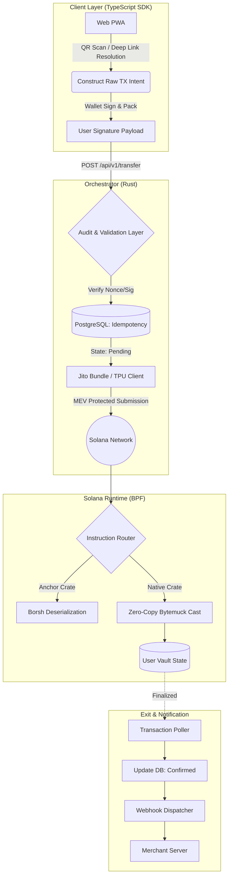
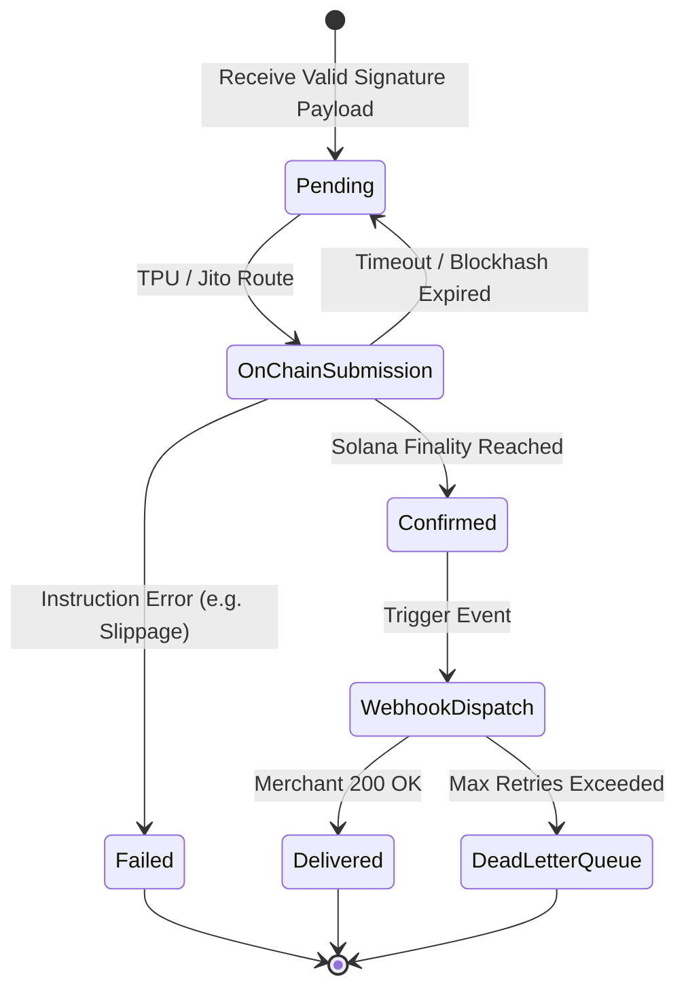
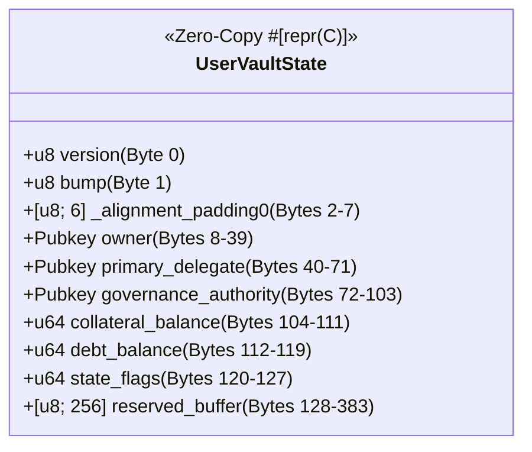

## 🏛️ System Architecture

### 1. Macro Execution Flow (Web-First Cryptographic Intent to Settlement)

The logical data flow enforces strict separation of concerns. The Web PWA handles the QR/Payment Link resolution and non-custodial cryptographic signing. The Orchestrator acts solely as an audit and compilation layer, validating the payload nonce and bypassing mempool latency via direct TPU/Jito submission.

### 2. Idempotency & Delivery State Machine

Network partitions will happen. The system guarantees exact-once execution using immutable database constraints mapped to Solana transaction signatures, completely mitigating client-side retry floods.

### 3. Native Zero-Copy Memory Layout (#[repr(C)])

To survive the BPF VM alignment rules without reallocation, the `StablecoinState` account must be an immutable byte window.

